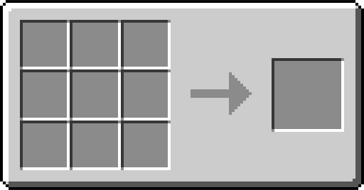

<!--
*** Thanks for checking out the Best-README-Template. If you have a suggestion
*** that would make this better, please fork the vCompat and create a pull request
*** or simply open an issue with the tag "enhancement".
*** Thanks again! Now go create something AMAZING! :D
***
***
***
*** To avoid retyping too much info. Do a search and replace for the following:
-->

<!-- PROJECT SHIELDS -->
<!--
*** I'm using markdown "reference style" links for readability.
*** Reference links are enclosed in brackets [ ] instead of parentheses ( ).
*** See the bottom of this document for the declaration of the reference variables
*** for contributors-url, forks-url, etc. This is an optional, concise syntax you may use.
*** https://www.markdownguide.org/basic-syntax/#reference-style-links
-->
[![Contributors][contributors-shield]][contributors-url]
[![Stargazers][stars-shield]][stars-url]
[![Issues][issues-shield]][issues-url]
[![MIT License][license-shield]][license-url]

<!-- PROJECT LOGO -->
 

  

  <h3 align="center">RecipeCalc</h3>

  

     
    <a href="https://github.com/PlayUniverse/RecipeCalc/releases"><strong>Download now »</strong></a>
     
     
    <a href="https://github.com/PlayUniverse/RecipeCalc/issues">Report Bug</a>
    ·
    <a href="https://github.com/PlayUniverse/RecipeCalc/issues">Request Feature</a>
  

<!-- TABLE OF CONTENTS -->

  
<h2 style="display: inline-block">Table of Contents</h2>

  <ol>
    <li>
      <a href="#about-the-project">About The Project</a>
      <ul>
        <li><a href="#created-with">Created with</a></li>
      </ul>
    </li>
    <li><a href="#usage">Usage</a></li>
    <li><a href="#license">License</a></li>
    <li><a href="#contact">Contact</a></li>
  </ol>

<!-- ABOUT THE PROJECT -->
## About The Project

<!-- [![Product Name Screen Shot][product-screenshot]](https://example.com) -->

### Created With

* [Godot](https://godotengine.org/)

<!-- USAGE EXAMPLES -->
## Usage

It's pretty simple, you just add ingredients and recipes.
Afterwards you select what u want to "craft" and how often and it will generate the graph for you.

With the import and export button on top you can also load and save already made recipes.

<!-- ROADMAP -->
## Roadmap

See the [open issues](https://github.com/PlayUniverse/RecipeCalc/issues) for a list of proposed features (and known issues).

<!-- CONTRIBUTING -->
## Contributing

Contributions are what make the open source community such an amazing place to be learn, inspire, and create. Any contributions you make are **greatly appreciated**.

1. Fork the Project
2. Create your Feature Branch (`git checkout -b feature/AmazingFeature`)
3. Commit your Changes (`git commit -m 'Add some AmazingFeature'`)
4. Push to the Branch (`git push origin feature/AmazingFeature`)
5. Open a Pull Request

<!-- LICENSE -->
## License

Distributed under the MIT License. See `LICENSE` for more information.

<!-- CONTACT -->
## Contact

PlayerUniverse - support@playuniverse.org

Project Link: [https://github.com/PlayUniverse/RecipeCalc](https://github.com/PlayUniverse/RecipeCalc)

<!-- MARKDOWN LINKS & IMAGES -->
<!-- https://www.markdownguide.org/basic-syntax/#reference-style-links -->
[contributors-shield]: https://img.shields.io/github/contributors/PlayUniverse/RecipeCalc.svg?style=flat-square
[contributors-url]: https://github.com/PlayUniverse/RecipeCalc/graphs/contributors
[stars-shield]: https://img.shields.io/github/stars/PlayUniverse/RecipeCalc.svg?style=flat-square
[stars-url]: https://github.com/PlayUniverse/RecipeCalc/stargazers
[issues-shield]: https://img.shields.io/github/issues/PlayUniverse/RecipeCalc.svg?style=flat-square
[issues-url]: https://github.com/PlayUniverse/RecipeCalc/issues
[license-shield]: https://img.shields.io/github/license/PlayUniverse/RecipeCalc.svg?style=flat-square
[license-url]: https://github.com/PlayUniverse/RecipeCalc/blob/master/LICENSE
